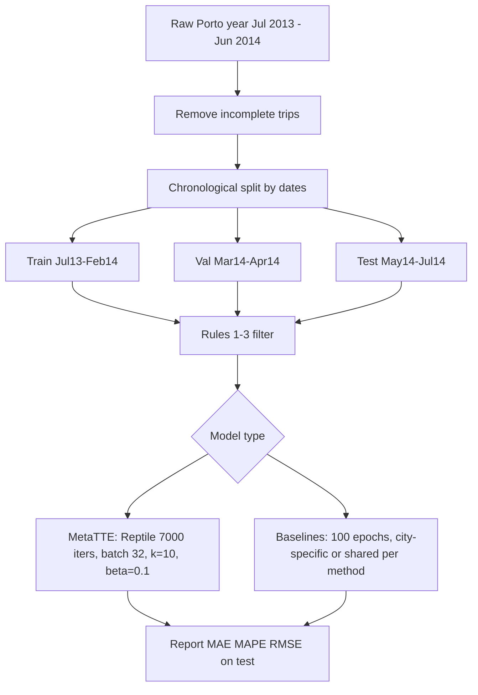

# MetaTTE (Wang et al., IEEE T-ITS) — Experiment protocol notes

**Source:** Chenxing Wang et al., *Fine-Grained Trajectory-based Travel Time Estimation for Multi-city Scenarios Based on Deep Meta-Learning* ([arXiv:2201.08017](https://arxiv.org/abs/2201.08017), accepted IEEE T-ITS; code: [maxwang967/MetaTTE](https://github.com/morningstarwang/MetaTTE)).

**Purpose:** Extract how MetaTTE evaluates on the **Porto taxi** dataset so we can align **Porto-T** baselines (especially **B6 MetaTTE**) with `MODEL_TRAINING_MATRIX.md` and future Springer experiment revisions.

---

## 1. Porto dataset (what they use)


| Item                            | Detail                                                                                                                                  |
| ------------------------------- | --------------------------------------------------------------------------------------------------------------------------------------- |
| **Source**                      | Kaggle *Taxi Trip Time Prediction (II)* — full-year trajectories (Jul 1, 2013 – Jun 30, 2014) for **442 taxis** in Porto, Portugal.     |
| **Unit of prediction**          | One **trajectory / trip** → single scalar **total travel time** (seconds).                                                              |
| **GPS handling**                | They **do not** resample to fixed time gaps (contrast with some Chengdu / DeepTTE-style pipelines); original irregular spacing is kept. |
| **Cleaning**                    | **Incomplete trajectories removed**; travel time computed per trajectory.                                                               |
| **Post-filter size (Table II)** | **1,674,152** trajectories on Porto after preprocessing (mean travel time **691.29 s**, std **347.48 s**).                              |


Meta-learning setup treats **Chengdu** and **Porto** as two **TTE-Tasks** T_i = (D^{\mathrm{train}}_i, D^{\mathrm{val}}_i, D^{\mathrm{test}}_i); one shared MetaTTE model is trained across both cities (Reptile), while several baselines (e.g. DeepTTE) use **separate models per city**.

---

## 2. Train / validation / test split (Porto)

### 2.1 Stated ratio

They describe a **chronological** split into:

- **Training:** 70%
- **Validation:** 10%
- **Test:** 20%

Splits are by **calendar date ranges**, not random trip shuffling. The same date ranges are **reproduced for all baselines** (Section III-B.1).

### 2.2 Exact Porto date ranges


| Split          | Date range (inclusive)          | Approx. duration |
| -------------- | ------------------------------- | ---------------- |
| **Train**      | **2013-07-01** → **2014-02-28** | ~8 months        |
| **Validation** | **2014-03-01** → **2014-04-01** | ~1 month         |
| **Test**       | **2014-05-01** → **2014-07-01** | ~2 months        |


**Implications:**

- **No temporal leakage** across splits if all features are fit only on train (and hyperparameters chosen on val).
- Test is **late spring / early summer 2014**; train covers Jul 2013 – Feb 2014 (winter + early year not in test).
- The 70/10/20 labels are **nominal**; actual trip counts per split are not tabulated in the paper—only aggregate post-Rule-1 statistics (Table II).

### 2.3 Chengdu (for cross-city context)


| Split | Date range              |
| ----- | ----------------------- |
| Train | 2014-08-03 → 2014-08-16 |
| Val   | 2014-08-21 → 2014-08-22 |
| Test  | 2014-08-24 → 2014-08-29 |


Porto and Chengdu are **never mixed within a single train/val/test partition** at the trip level; meta-training **alternates tasks** (randomly samples Chengdu or Porto each Reptile iteration).

---

## 3. Preprocessing after the temporal split

Applied in the **Data preprocessing module** (Rules 1–3). Rule 1 thresholds come from **CDF 10%–80%** analysis on each city (Section III-B.2, Table III).

### Rule 1 — keep “typical” trips only (Porto)


| Constraint        | Porto value |
| ----------------- | ----------- |
| Travel time ≥     | **315 s**   |
| Travel time ≤     | **945 s**   |
| Travel distance ≥ | **1.76 km** |
| Travel distance ≤ | **7.32 km** |


Rationale in paper: drop rare / dirty tails (CDF below 10% or above 80%) that bias training when meta-learning uses **small batches per iteration**.

### Rule 2

Keep trajectory **only if it has ≥ 2 distinct GPS points** (drop single-point “trips”).

### Rule 3

Keep trajectory **only if total travel time > 0**.

**Important for replication:** Rule 1 removes many long trips (> 945 s) from training; test-set slices with travel time **> 14 min** are discussed as partly **“unseen”** relative to Rule 1 (Section V-B.3, Figures 9–10).

---

## 4. How many times did they repeat experiments?


| Question                       | Answer in paper                                                                                                                                                                                 |
| ------------------------------ | ----------------------------------------------------------------------------------------------------------------------------------------------------------------------------------------------- |
| **Multiple random seeds?**     | **Not reported.** No seed list, no mean ± std over runs.                                                                                                                                        |
| **K-fold cross-validation?**   | **No.** Single chronological hold-out.                                                                                                                                                          |
| **Repeated training runs?**    | **No** explicit repetition; Table IV/V/VI/VIII report **one number per method × city**.                                                                                                         |
| **Meta-training “repetition”** | **7000 Reptile iterations** (each iteration: sample one city-task, **k = 10** Adam steps on a batch, then meta-update)—this is **optimization iterations**, not independent experiment repeats. |
| **Baseline training**          | **100 epochs** per baseline (Chengdu and Porto **separately** for conventional DL baselines), with “**fine-tuned hyperparameters**” (details of search not fully specified).                    |


**Contrast with our Springer draft (`sections/experiments.tex`):** we report **mean over seeds 42, 43, 44** and **model selection by lowest validation MAE per seed**. MetaTTE does **not** document an equivalent protocol.

---

## 5. Metrics — what and how

### 5.1 Reported metrics (Table IV and stratified figures)

All main numbers are on **travel time in seconds**:


| Metric   | Symbol in tables | Notes from paper                                                                                                                                                                                           |
| -------- | ---------------- | ---------------------------------------------------------------------------------------------------------------------------------------------------------------------------------------------------------- |
| **MAE**  | MAE              | Used as **convergence criterion** during MetaTTE training (“satisfied MAE … within 7000 iterations”).                                                                                                      |
| **MAPE** | MAPE (%)         | Authors argue MAPE is **more important for user-facing apps** than RMSE in some regimes (Section V-B.3).                                                                                                   |
| **RMSE** | RMSE             | They note MetaTTE-GRU can be **worse than DeepTTE on Porto RMSE** while winning on MAE/MAPE, and attribute this to **outliers / tail trips** and **one shared model vs two city-specific DeepTTE models**. |


### 5.2 Explicit formulas

The paper **does not** print equations for MAE, MAPE, or RMSE. Table IV caption only states:

> *“Notice that all metrics are calculated based on travel time in seconds.”*

**Standard definitions** (inferred for replication; confirm against [MetaTTE code](https://github.com/morningstarwang/MetaTTE)):

- **MAE:** \mathrm{MAE} = \frac{1}{N}\sum_{i=1}^{N} |y_i - \hat{y}_i| (seconds).
- **RMSE:** \mathrm{RMSE} = \sqrt{\frac{1}{N}\sum_{i=1}^{N} (y_i - \hat{y}_i)^2} (seconds).
- **MAPE:** typically \mathrm{MAPE} = \frac{100}{N}\sum_{i=1}^{N} \frac{|y_i - \hat{y}_i|}{y_i} (%); exact handling of y_i \approx 0 is **not** specified (Rule 3 ensures y > 0).

**Evaluation set:** Primary Table IV = **full test split** after preprocessing. Additional **stratified** curves (Figures 9–12) bin test trips by **travel-time** or **travel-distance** quantiles / bands.

### 5.3 Training loss vs reported metric

- MetaTTE inner loop: minimize task loss L_{T_i} with **Adam** (Section IV-C, Algorithm 2); paper emphasizes **MAE** for stopping at \eta = 7000 but does not explicitly equate L_{T_i} with L1 loss in one sentence—**verify in code**.
- Baselines: conventional epoch training; comparison table generated in “**test phase**” after 100 epochs.

### 5.4 Porto results (Table IV, MetaTTE-GRU vs selected baselines)


| Method          | MAE       | MAPE (%) | RMSE       |
| --------------- | --------- | -------- | ---------- |
| DeepTTE         | 84.29     | 14.79    | 90.29      |
| Nei-TTE         | 106.30    | 15.23    | 183.03     |
| GBM             | 148.53    | 24.59    | 209.07     |
| **MetaTTE-GRU** | **62.43** | **8.83** | **196.78** |


Paper claims **~25.93%** improvement vs best baseline on Porto (abstract)—relative to their chosen baseline and metric mix.

---

## 6. Training & evaluation procedure (summary)




### MetaTTE hyperparameters (Section V-B.2)


| Parameter          | Value                                           |
| ------------------ | ----------------------------------------------- |
| Batch size         | 32                                              |
| Step size β        | 0.1 (best in Table V sweep)                     |
| Inner steps k      | 10 batches per iteration                        |
| Max iterations η   | 7000                                            |
| Embedding dim D    | 64                                              |
| RNN units n_r      | 64                                              |
| Residual FC widths | 1024, 512, 256, 64                              |
| Optimizer          | Adam (inner), Reptile-style meta-update (Eq. 9) |
| Init               | Xavier                                          |


### Baselines (Section V-A)

Nine methods in Table IV: **AVG, LR, GBM, TEMP, WDR, DeepTTE, STNN, MURAT, Nei-TTE** (abstract text says “six” — table is authoritative).

- **AVG / LR / GBM / TEMP:** classical / neighbor / boosting features (cited to prior TTE work).
- **DeepTTE:** trajectory CNN + LSTM; **separate models** for Chengdu and Porto.
- **MetaTTE variants:** ablations (WT, WA, LSTM, BiLSTM, **GRU** best in tables).

### Hyperparameter tuning reported

- **β ∈ {0.05, 0.1, 0.3}** (Table V) — reported on **both** cities; **β = 0.1** chosen.
- **(D, n_r) ∈ {(32,32), (64,64), (128,128), (256,256)}** (Table VI) — **(64,64)** chosen.
- Tuning appears **manual / grid on validation**, but paper does **not** state “select checkpoint with lowest val MAE” explicitly.

### Hardware

Dawn cluster node: Intel E5-2680, 64 GB RAM, Tesla V100S, CentOS 7.4, **TensorFlow 2.3**.

---

## 7. Other experiment details worth carrying forward

1. **SSS**8. Gaps vs our planned protocol (`MODEL_TRAINING_MATRIX.md`)


| Aspect          | MetaTTE (paper)                 | Our draft / matrix intent                                               |
| --------------- | ------------------------------- | ----------------------------------------------------------------------- |
| Split           | Fixed Porto **calendar** ranges | SUMO chronological + Porto-G / Porto-T to be documented consistently    |
| Repeats         | **Single run**, no seeds        | **Seeds 42–44**, mean ± std                                             |
| Model selection | η = 7000 fixed; β/D grid        | **Lowest val MAE** per seed                                             |
| Trip filter     | Rule 1: 315–945 s, 1.76–7.32 km | Must decide if Porto-T replication **matches** or documents differences |
| Input           | Raw trajectory (Porto-T)        | Porto-G graph + SUMO; Porto-T for DeepTTE/MetaTTE                       |
| Metrics         | MAE, MAPE, RMSE (seconds)       | Same family; we also use **duration bins**                              |


**Recommendation for B6 (MetaTTE):** To compare against Table IV Porto columns, replicate **date splits + Rules 1–3** on the **same Porto-T extraction**; note in the paper if our filter or trip definition differs. Do **not** expect numeric match if we keep multi-seed reporting and different trip counts.

---

## 9. Quick reference — Porto split dates (copy-paste)

```
Train:      2013-07-01  ..  2014-02-28
Validation: 2014-03-01  ..  2014-04-01
Test:       2014-05-01  ..  2014-07-01
```

Rule 1 (Porto): time ∈ [315, 945] s, distance ∈ [1.76, 7.32] km, ≥ 2 GPS points, time > 0.

---

---

## 10. Why our AVG baseline does not match MetaTTE's reported 148.53 s MAE

**Our result (test):** MAE ≈ 113 s, RMSE ≈ 143 s, MAPE ≈ 21 %

**MetaTTE Table IV (Porto):** AVG MAE 148.53 s, RMSE 209.07 s, MAPE 24.59 %

### What MetaTTE's "1,674,152 trajectories" count means

MetaTTE Table II reports 1,674,152 Porto trajectories with **mean travel time 691 s, std 347 s**. A distribution bounded by Rule 1's [315, 945 s] cap could not produce std 347 s (theoretical max for a uniform distribution over that range is ~182 s). Therefore Table II describes the dataset **before Rule 1** — it is the post-incomplete-removal count, reported for context. MetaTTE's actual training/evaluation uses Rule-1-filtered data.

### Three experiments to isolate the cause

| Configuration | Test trips | Test MAE (s) | MAPE (%) |
|---|---|---|---|
| Rules 1–4 (our default) | 161,401 | 113.29 | 20.83 |
| Rules 1–3 only (no Rule 4) | 164,032 | 113.87 | 20.99 |
| Rules 2–3 only (non-screened, no Rule 1) | 308,757 | 283.65 | 76.87 |
| MetaTTE Table IV (their pipeline) | — | **148.53** | 24.59 |

**Removing Rule 4** changes MAE by < 1 s — not the cause.

**Removing Rule 1** raises MAE to 283 s — far above MetaTTE's 148 s — confirming MetaTTE **does** apply Rule 1 and their results are on the Rule-1-filtered distribution.

### Actual cause: our AVG implementation is stronger

MetaTTE's results are on Rule-1-filtered data just like ours, yet they report 148 s vs our 113 s. The remaining ~35 s gap is because our AVG uses a **0.01° OD grid + 24 hour-of-day slots** achieving 96% L1 hit rate — effectively near-memorisation of mean travel time per fine-grained OD cell and time of day. MetaTTE's AVG baseline is almost certainly coarser (larger cells, fewer or no time buckets), which is typical for a "minimum baseline" in a paper focused on meta-learning rather than optimising the average.

### Implication for the paper

Do **not** present our AVG number (113 s) as a direct replication of MetaTTE's AVG (148 s). In the baseline table caption, add a note such as:

> *"Baselines are retrained on our Porto-T preprocessing (Rules 1–4, §X). Our AVG uses a 0.01° OD grid with 24 hour-of-day buckets; MetaTTE's AVG uses a coarser grouping, yielding higher reported error. All methods in this table are evaluated on the same filtered test split."*

This applies to all Porto-T baselines (B1–B6): numbers are not directly comparable to MetaTTE Table IV because (a) our filtered distribution is narrower and (b) our implementations may differ. The comparison is valid within our table (same protocol for every method).

---

*Last updated from PDF text extraction of `references/MetaTTE.pdf` (IEEE T-ITS manuscript, arXiv v1 Jan 2022). Verify edge cases in official code before submission-critical replication.*